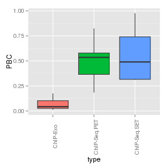
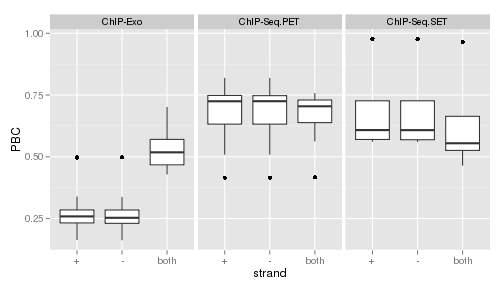

## PCR bottleneck report

### PCR bottleneck		


According to the **ENCODE** definitions of [quality metrics](http://encodeproject.org/ENCODE/qualityMetrics.html#definitions), one of the metrics used is the *PCR bottleneck coefficient* or **PBC**.

The definition is:

A measure of library complexity, i.e. how skewed the distribution of read counts per location is towards 1 read per location.

PBC = N1/Nd

(where N1= number of genomic locations to which **EXACTLY** one unique mapping read maps, and Nd = the number of genomic locations to which **AT LEAST** one unique mapping read maps, i.e. the number of non-redundant, unique mapping reads).

In particular we can see that always N1 <= Nd, so 0<= PBC <= 1. ENCODE recomends the following classification:

| PBC range | Bottleneck class |
| :---:     | :---: |
|0 -0.5  | Severe |
| 0.5-0.8 | Moderate|
|0.8-0.9 | Mild |
|0.9 - 1| Non-existant|


### Code

The following function was used to calculate the PBC:


```r
PBC <- function(file,cap = Inf)
{
  require(GenomicAlignments)
  message(file)
  rr = readGAlignmentsFromBam(file,param = NULL)
  ss1 = subset(rr,subset =strand(rr)=="+")
  ss2 = subset(rr,subset = strand(rr)=="-")
  tab1 = table(start(ss1))
  tab2 = table(end(ss2))
  tab = table(c(start(ss1),end(ss2)))
  PBC1 = round(sum(tab1 == 1)/sum(tab1 >= 1 & tab1 <= cap),4)
  PBC2 = round(sum(tab2 == 1)/sum(tab2 >= 1 & tab2 <= cap),4)
  PBC = round(sum(tab == 1) / sum(tab >= 1 & tab <= 4),4)
  message("PBC +:",PBC1)
  message("PBC -:",PBC2)
  message("PBC:",PBC)
  return(c(PBC_plus=PBC1,PBC_minus=PBC2,PBC=PBC))  
}
```


### Figures

#### Figure 1

 

We can see:
- The overall level of the ChIP-Exo's PBC coefficients is lower than the level of the other two ChIP-Seq labels
- The level of ChIP-Seq PET is higher that the level of both SET generated y ChIP-Seq and ChIP-Exo

#### Figure 2

 

- For this plot, the PBC coefficents was calculated using only the reads with certain strand. In particular, we can see that for all 3 types, the boxplots for both strands are very similar.
- The observations of figure 1 hold for both strands.
- Also, we can see that for both ChIP-Seq types, the overall level of the PBC calculated using both strands is lower than the PBC level calculating only one strand (in particular the level of the PBC score is approximately the same for both strands). However, for ChIP-Exo, we can see that the level of the PBC score increases when both strands are joined.


### Tables

#### ChIP - Seq - SET

|                                        | PBC_plus| PBC_minus|    PBC|
|:---------------------------------------|--------:|---------:|------:|
|run101_Input_posO2_042814_qc.sorted.bam |   0.9773|    0.9763| 0.9650|
|run62_Input_negO2_042814_qc.sorted.bam  |   0.6431|    0.6434| 0.4638|
|run80_sig70_negO2_042814_qc.sorted.bam  |   0.5732|    0.5721| 0.5464|
|run80_sig70_posO2_042814_qc.sorted.bam  |   0.5611|    0.5600| 0.5631|

#### ChIP - Seq - PET

|                              | PBC_plus| PBC_minus|    PBC|
|:-----------------------------|--------:|---------:|------:|
|edsn1369_042814_qc.sorted.bam |   0.8194|    0.8192| 0.7114|
|edsn1396_042814_qc.sorted.bam |   0.7815|    0.7808| 0.7580|
|edsn1397_042814_qc.sorted.bam |   0.7369|    0.7359| 0.7506|
|edsn1398_042814_qc.sorted.bam |   0.6797|    0.6798| 0.6972|
|edsn1399_042814_qc.sorted.bam |   0.5086|    0.5089| 0.5626|
|edsn1400_042814_qc.sorted.bam |   0.7328|    0.7317| 0.7333|
|edsn1401_042814_qc.sorted.bam |   0.7367|    0.7361| 0.7287|
|edsn1402_042814_qc.sorted.bam |   0.7167|    0.7180| 0.7213|
|edsn1403_042814_qc.sorted.bam |   0.5490|    0.5493| 0.5958|
|edsn1416_042814_qc.sorted.bam |   0.8084|    0.8086| 0.6795|
|edsn788_042814_qc.sorted.bam  |   0.6599|    0.6597| 0.6525|
|edsn790_042814_qc.sorted.bam  |   0.4153|    0.4152| 0.4164|

#### ChIP - Exo

|                              | PBC_plus| PBC_minus|    PBC|
|:-----------------------------|--------:|---------:|------:|
|edsn1310_042814_qc.sorted.bam |   0.2849|    0.2805| 0.5952|
|edsn1311_042814_qc.sorted.bam |   0.2800|    0.2846| 0.5207|
|edsn1312_042814_qc.sorted.bam |   0.2545|    0.2482| 0.5181|
|edsn1313_042814_qc.sorted.bam |   0.3393|    0.3376| 0.5929|
|edsn1314_042814_qc.sorted.bam |   0.2691|    0.2706| 0.4674|
|edsn1315_042814_qc.sorted.bam |   0.2332|    0.2355| 0.5281|
|edsn1316_042814_qc.sorted.bam |   0.2587|    0.2529| 0.5703|
|edsn1317_042814_qc.sorted.bam |   0.2656|    0.2657| 0.5515|
|edsn1318_042814_qc.sorted.bam |   0.3036|    0.3011| 0.4743|
|edsn1319_042814_qc.sorted.bam |   0.4975|    0.4976| 0.6856|
|edsn1320_042814_qc.sorted.bam |   0.2151|    0.2157| 0.4502|
|edsn1321_042814_qc.sorted.bam |   0.2140|    0.2157| 0.4851|
|edsn930_042814_qc.sorted.bam  |   0.4964|    0.4985| 0.7017|
|edsn931_042814_qc.sorted.bam  |   0.2136|    0.2177| 0.4282|
|edsn932_042814_qc.sorted.bam  |   0.2950|    0.2939| 0.6234|
|edsn933_042814_qc.sorted.bam  |   0.2489|    0.2455| 0.4606|
|edsn934_042814_qc.sorted.bam  |   0.1749|    0.1783| 0.5256|
|edsn935_042814_qc.sorted.bam  |   0.2604|    0.2576| 0.4395|
|edsn936_042814_qc.sorted.bam  |   0.2323|    0.2307| 0.5109|
|edsn937_042814_qc.sorted.bam  |   0.2480|    0.2456| 0.4529|
|edsn938_042814_qc.sorted.bam  |   0.1633|    0.1621| 0.5067|

