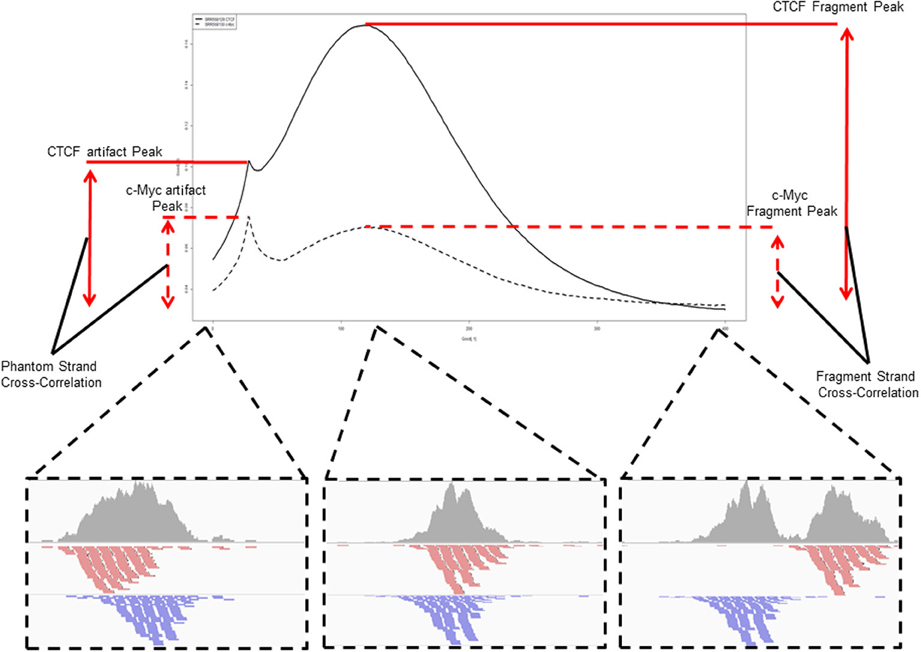

## Strand exploratory analysis

### What is the idea behind the strand cross - correlation

According to [ChIP-seq guidelines and practices of the ENCODE and modENCODE consortia](http://www.ncbi.nlm.nih.gov/pmc/articles/PMC3431496/), a useful quality metric is the use of strand cross - correlation. Which is based in the fact that a high-quality ChIP-Seq experiment produces significant clustering of enriched DNA sequence tags at locations bound by the protein of interest, and that the sequence tag density acumulates in both strand centered around the binding site.

A graphical explanation of this effect is given in the figure 5 of [Carroll et. al. 2014's paper](http://journal.frontiersin.org/Journal/10.3389/fgene.2014.00075/full):

In this figure we can see an ideal case of the fragment length estimation by the use of the cross correlation function. On the top panel we can see a very smooth cross correlation function that shows both the an artifact peak and a fragment peak. In the bottom panels we can see (from left to right):
- An under estimation of the shift between both strands, which makes the pooled peak of both strands wider and therefore harder to recognize the binding event signal. In this case the fragment length is under-estimated as a the shift size where the artifact peak is ocurring.
- Just right, the shift is estimated at the peak of the cross correlation function. Which makes the signal to be higher and more recognizable when both strand reads are pooled.
- The shift is over-estimated. Which makes to have a "bimodal" peak when both strands are pooled.

### Description of the experiment

In this experiment we are trying to check how the effect explained above occurrs for reads generated by the ChIP - exo protocol. For that purpose, the following regions where visually located using the e. coli genome viewer Mochi-view:

|seqnames |   start|     end| width|strand |
|:--------|-------:|-------:|-----:|:------|
|U00096   |  576875|  577874|  1000|*      |
|U00096   |  798921|  799920|  1000|*      |
|U00096   | 1152674| 1153673|  1000|*      |
|U00096   | 1192831| 1193830|  1000|*      |
|U00096   | 1820005| 1821004|  1000|*      |
|U00096   | 2310506| 2311505|  1000|*      |
|U00096   | 2996662| 2997661|  1000|*      |
|U00096   | 3351853| 3352852|  1000|*      |
|U00096   | 3973436| 3974435|  1000|*      |
|U00096   | 4262028| 4263027|  1000|*      |

For the inspection the following structures where considered:

| Rep| Rif|IP            | exo.edns| pet.edsn|
|---:|---:|:-------------|--------:|--------:|
|   1|   0|Sigma70       |     1311|     1396|
|   1|   0|BetaPrimeFlag |     1312|     1397|
|   1|  20|Sigma70       |     1314|     1398|
|   1|  20|BetaPrimeFlag |     1315|     1399|
|   2|   0|Sigma70       |     1317|     1400|
|   2|   0|BetaPrimeFlag |     1318|     1401|
|   2|  20|Sigma70       |     1320|     1402|
|   2|  20|BetaPrimeFlag |     1321|     1403|

| Rep| Rif|IP   | exo.edns|
|---:|---:|:----|--------:|
|   1|   0|Beta |     1310|
|   1|  20|Beta |     1313|
|   2|   0|Beta |     1316|
|   2|  20|Beta |     1319|

