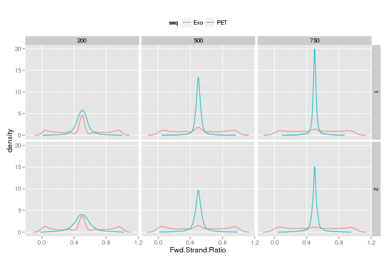

<!--
%\VignetteEngine{knitr}
%\VignetteIndexEntry{Forward Strand ratio density}
%\VignetteDepends{ggplot2, ChIP-Exo, GenomicAlignments}
-->

### Forward strand ratio density

For this analysis, we partitioned the E. Coli genome into bins. For each bin, the number of forward and backward reads that overlap it were counted. Finally, the forward strand proportion was calculated as:


#### Code used

Lets notice, a normal kernel is used and the bandwidth is estimated by cross - validation.


```r
density.reads.per.strand.ratio
```

```
## function (bins, reads) 
## {
##     counts_F = countOverlaps(bins, subset(reads, subset = strand(reads) == 
##         "+"))
##     counts_R = countOverlaps(bins, subset(reads, subset = strand(reads) == 
##         "-"))
##     ratio = (counts_F + 1)/(counts_F + counts_R + 2)
##     return(density(ratio))
## }
```

For this experiment we are comparing the samples when :
- The IP is either Sig70 or BetaPrimeFlag
- The samples were submitted to 0 min or 20 min of rif treatment
- The growth was aerobic
- The phase was exponential


#### Estimated densities

Initially several bin sizes were considered, but some of them undersmoothed the densities and others oversmoothed it. Therefore the densities calculated with bin size 200, 500 and 750 are shown. I


|edsn |cult |ip    |phase       |growth  |rif   |rep |seq |
|:----|:----|:-----|:-----------|:-------|:-----|:---|:---|
|1311 |1197 |Sig70 |Exponential |Aerobic |0 min |1   |Exo |
|1317 |1202 |Sig70 |Exponential |Aerobic |0 min |2   |Exo |
|1396 |1197 |Sig70 |Exponential |Aerobic |0 min |1   |PET |
|1400 |1202 |Sig70 |Exponential |Aerobic |0 min |2   |PET |


```r
p <- ggplot(df,aes(Fwd.Strand.Ratio,density,colour = seq))+geom_line()+
  facet_grid(Rep ~ binSize) + theme(legend.position = "top")
print(p)
```

 

#### Tables


|edsn |cult |ip            |phase       |growth  |rif    |rep |seq |
|:----|:----|:-------------|:-----------|:-------|:------|:---|:---|
|1311 |1197 |Sig70         |Exponential |Aerobic |0 min  |1   |Exo |
|1312 |1197 |BetaPrimeFlag |Exponential |Aerobic |0 min  |1   |Exo |
|1314 |1197 |Sig70         |Exponential |Aerobic |20 min |1   |Exo |
|1315 |1197 |BetaPrimeFlag |Exponential |Aerobic |20 min |1   |Exo |
|1317 |1202 |Sig70         |Exponential |Aerobic |0 min  |2   |Exo |
|1318 |1202 |BetaPrimeFlag |Exponential |Aerobic |0 min  |2   |Exo |
|1320 |1202 |Sig70         |Exponential |Aerobic |20 min |2   |Exo |
|1321 |1202 |BetaPrimeFlag |Exponential |Aerobic |20 min |2   |Exo |


|edsn |cult |ip            |phase       |growth  |rif    |rep |seq |
|:----|:----|:-------------|:-----------|:-------|:------|:---|:---|
|1396 |1197 |Sig70         |Exponential |Aerobic |0 min  |1   |PET |
|1397 |1197 |BetaPrimeFlag |Exponential |Aerobic |0 min  |1   |PET |
|1398 |1197 |Sig70         |Exponential |Aerobic |20 min |1   |PET |
|1399 |1197 |BetaPrimeFlag |Exponential |Aerobic |20 min |1   |PET |
|1400 |1202 |Sig70         |Exponential |Aerobic |0 min  |2   |PET |
|1401 |1202 |BetaPrimeFlag |Exponential |Aerobic |0 min  |2   |PET |
|1402 |1202 |Sig70         |Exponential |Aerobic |20 min |2   |PET |
|1403 |1202 |BetaPrimeFlag |Exponential |Aerobic |20 min |2   |PET |


