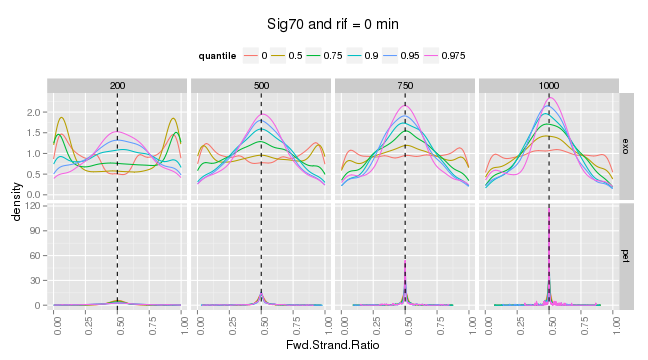

<!--
%\VignetteEngine{knitr}
%\VignetteIndexEntry{Forward Strand ratio density}
%\VignetteDepends{ggplot2, ChIP-Exo, GenomicAlignments}
-->

### Forward strand ratio density conditional to high count regions

For this analysis, we followed the same ideas as in the [forward strand ratio analysis](../Fwd_strand_ratio_density.md). However, we are conditioning the bins to consider only the ones that have counts higher than certain quantile.


```r
quantile.df
```

```
## function (binSize, prob, type, Rep, seqset) 
## {
##     bins = create.bins(binSize, seqlengths(seqset))
##     bins$counts = countOverlaps(bins, seqset)
##     seqquantile = quantile(bins$counts, prob)
##     dens = density.reads.per.strand.ratio(subset(bins, subset = counts > 
##         seqquantile), seqset)
##     df = data.frame(Fwd.Strand.Ratio = dens$x, density = dens$y, 
##         binSize = binSize, quantile = prob, Rep = Rep, type = type)
##     return(df)
## }
```

First we are showing a comparison of the conditional densities of the ChIP-seq pet samples vs the ChIP-exo samples such that their edsn is > 1300. Considering the case when the Ip is Sig70, the rif time is 20 min, the grown is aerobic and the phase is exponential we can see, only for the first replicate:


 

In the figure above we can see some behaviour that repeat accross several cases:
- For ChIP-seq PET samples, the conditional forward strand ratio density behaves almost like a dirac delta centered in 0.5. Which means that for almost all the bins (for all bin sizes), there are approximately the same number of reads in the forward strand than in the backward strand.
- For ChIP-seq PET samples, as the quantile increases we can see that the height of the density function at a ratio of 0.5 increases and the range of the density becomes smaller.

For the ChIP-exo samples we can see:
- When the bin size is smaller it is more likely to see a bimodal density with the modes being symmetric around a ratio = 0.5, and as the quantile increases we can see that the shape of the density resembles more the one of a unimodal density. Which means that the bins where there is an assymetry in the reads of each strand are the ones with lower counts.
- As the bin size increase the mode of the density is taller and the tails of the density seems to be lighter.
 


