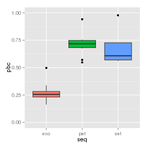
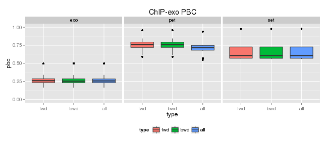
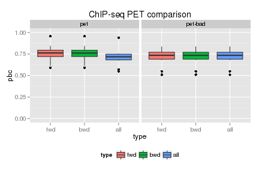

## PCR bottleneck report

### PCR bottleneck		


According to the **ENCODE** definitions of [quality metrics](http://encodeproject.org/ENCODE/qualityMetrics.html#definitions), one of the metrics used is the *PCR bottleneck coefficient* or **PBC**.

The definition is:

A measure of library complexity, i.e. how skewed the distribution of read counts per location is towards 1 read per location.

PBC = N1/Nd

(where N1= number of genomic locations to which **EXACTLY** one unique mapping read maps, and Nd = the number of genomic locations to which **AT LEAST** one unique mapping read maps, i.e. the number of non-redundant, unique mapping reads).

In particular we can see that always N1 <= Nd, so 0<= PBC <= 1. ENCODE recomends the following classification:

| PBC range | Bottleneck class |
| :---:     | :---:            |
|0 -0.5     | Severe           |
| 0.5-0.8   | Moderate         |
|0.8-0.9    | Mild             |
|0.9 - 1    | Non-existant     |


### Code

The following function was used to calculate the PBC:


```r
pbc_fun
```

```
## function (tags) 
## {
##     tab = table(tags)
##     nUniq = sum(tab == 1)
##     nTotal = sum(tab >= 1)
##     return(round(nUniq/nTotal, 4))
## }
```


### Figures

#### Figure 1

 

We can see:
- The overall level of the ChIP-Exo's PBC coefficients is lower than the level of the other two ChIP-Seq labels
- The level of ChIP-Seq PET is higher that the level of both SET generated y ChIP-Seq and ChIP-Exo

#### Figure 2

 

- For this plot, the PBC coefficents was calculated using only the reads with certain strand. In particular, we can see that for all 3 types, the boxplots for both strands are very similar.
- The observations of figure 1 hold for both strands.
- We can see that for all data types: The PBC level for each individual strand is very close to the one calculated using both strands.
- After inspecting the calculated values in the tables below, we can see that for both ChIP-Seq tags, the level of the PBC calculated with both strands is in between of the PBC's calculated using only one strand. However, for most of the ChIP-Exo samples, we can see that the PBC calculated with both strand is slightly higher than the PBC calculated for both individual strands.

#### Figure 3

 
- For this plot we calculated the PBC for the ChIP-seq PET samples. Considering them as PET data and as SET data (as previously did), this is labeled as "pet-bad"
- The levels are approximately the same. However, when calculating the PBC as PET we can see that there are upper and lower outliers instead of only lower outliers. This means, that there are some cases when calculating the PBC as PET improves the value of the PCR bottleneck coefficient.
- Also we can see that the levels for the one-stranded PBC are approximately the same for both cases. However, for the complete case we can see a decrease in the overall value of the coefficient. Also, we can see a decrease in the inter-quartile difference.


